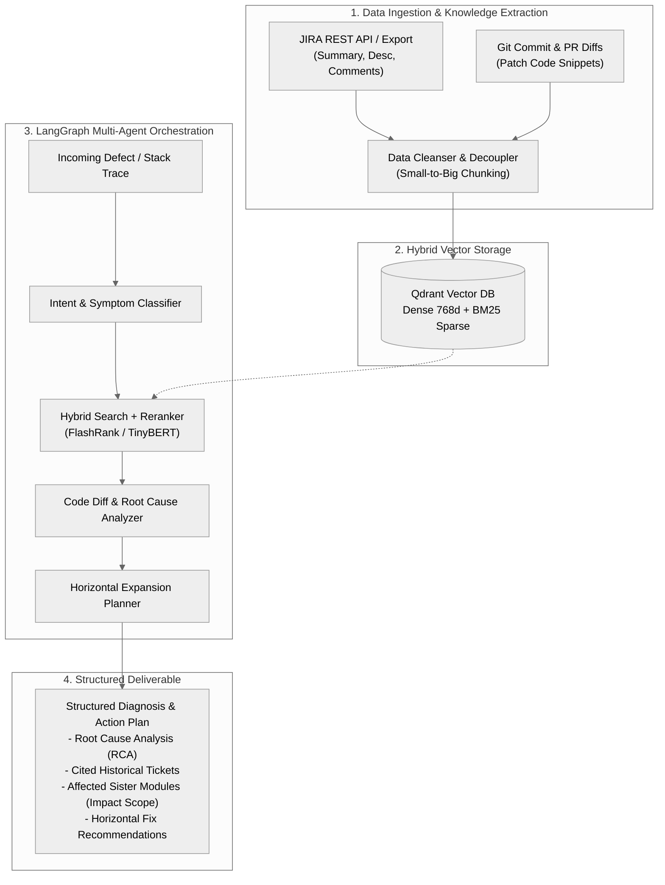

# JIRA-BugGraph AI: Defect Knowledge Base & Intelligent Horizontal Expansion System

> An enterprise-grade AI system leveraging Advanced RAG, Hybrid Retrieval (Dense + BM25 Sparse), FlashRank Reranking, and LangGraph multi-agent orchestration to transform historical JIRA defect data into actionable root-cause diagnoses and horizontal expansion fix recommendations.

---

## 1. Project Overview & Charter

* **Project Name**: JIRA-BugGraph AI
* **Team**: KANZI SERVICE (Nagoya Site, Japan)
* **Demo Repository**: [rag-chatbot](https://github.com/boycececil666gmailcom/rag-chatbot) / [Enterprise-RAG-Engine](https://github.com/boycececil666gmailcom/Enterprise-RAG-Engine)
* **Branch Focus**: `JIRA` branch is exclusively dedicated to the design, implementation, and benchmarking of this system.

---

## 2. Industry Context & Core Pain Points

In software maintenance and enterprise software delivery (particularly in Japanese OEM, Tier-1 automotive, and embedded engineering workflows), new defects frequently share root causes with historical bugs. **Horizontal Expansion ("横展开发")**—the engineering practice of propagating a known defect resolution across all related subsystems, components, and codebases to prevent recurring failures—is a vital quality assurance process.

Currently, historical JIRA issues act as a "dormant data asset" with severe operational bottlenecks:

### 2.1 Keyword Search Inefficiency
* Native JIRA search is limited to exact keyword matching and cannot interpret error logs, stack traces, or code-level semantic logic.
* Dissimilar symptom phrasing or variant error descriptions cause historical resolutions to be missed entirely.

### 2.2 Over-Reliance on Senior Engineers' Memory
* Identifying historical precedent for horizontal expansion relies heavily on veteran developers' recall.
* Onboarding junior engineers is slow, and human oversight causes identical defect patterns to recur in production.

### 2.3 Knowledge Disconnection & Fragmentation
* Triage reasoning, investigation steps, discussion threads, and actual code patches are scattered across ticket descriptions, comment streams, and Git pull requests.
* When team members transition, undocumented implicit engineering experience is permanently lost.

---

## 3. Target Personas & Platform Scope

### 3.1 Direct Users
* **Software Developers**: Rapidly locate analogous defect tickets, error signatures, and reference code diffs during debugging.
* **QA & Test Engineers**: Validate whether a reported issue is a known regression or requires systematic horizontal test coverage across sister modules.
* **Tech Leads & Architects**: Audit cross-module defect trends and verify the thoroughness of proposed horizontal fix plans.
* **Project Managers (PMs)**: Track defect clustering, resolution velocity, and recurring subsystem vulnerabilities.

### 3.2 Long-Term Vision
* Standardized R&D developer efficiency tool and internal IDE/JIRA plugin across business groups.

---

## 4. End-to-End Technical Architecture

---

## 5. Core Architectural Pillars

### 5.1 Dual-Channel Hybrid Search (Dense + Sparse)
* **Dense Semantic Vector Retrieval**: Captures conceptual defect similarities, natural language symptom descriptions, and high-level architectural behavior.
* **BM25 Sparse Retrieval**: Guarantees exact matches for strict programming tokens: error codes, exception classes, variable names, register addresses, and log patterns.

### 5.2 FlashRank Reranking Context Purification
* Passes Top-K hybrid candidates through lightweight reranking models (e.g. FlashRank TinyBERT / BGE Reranker) to filter out irrelevant noise prior to LLM reasoning.

### 5.3 Small-to-Big Retrieval Schema
* Decouples search matching tokens (`small` chunk for dense & sparse vector similarity) from context delivery (`big` markdown block & code diff for LLM reasoning), maximizing both precision and coherence.

### 5.4 LangGraph State Machine for Defect Reasoning
* Implements deterministic, multi-step agent graphs with typed state (`DefectState`).
* Evaluates confidence scores and initiates automated review if historical evidence confidence falls below threshold.

---

## 6. Business Value & Target Key Results

| Metric Category | Baseline Value | Target Milestone | Verification Method |
| :--- | :--- | :--- | :--- |
| **Time to Position (TTP)** | ~45 min / issue | ≤ 22.5 min (≥ 50% reduction) | Timed investigation pilots on historical defect batches |
| **Retrieval Recall@5** | Unmeasured (< 50% native JIRA) | ≥ 85% | Automated Ragas benchmark against defect ground truth |
| **Defect Recurrence Rate** | Baseline | ≥ 30% reduction | Post-release defect tracking in pilot projects |
| **Data Privacy & Compliance** | Full isolation | 100% on-premise / private cloud | Dockerized local stack (Qdrant, LangGraph) |

---

## 7. Roadmap & Delivery Phases

### Phase 1: Data Pipeline & Ingestion Ingest (Current)
* [x] Initialize streamlined local infrastructure via Docker Compose (Qdrant, Backend, LangGraph Studio).
* [ ] Construct JIRA dataset scraper and JSON schema converter in `preprocessing-pipeline/`.
* [ ] Implement Small-to-Big Markdown + Diff chunking strategy for ticket threads.

### Phase 2: Hybrid Indexing & Qdrant Collections
* [ ] Populate Qdrant collections with dense vector embeddings and BM25 sparse vectors.
* [ ] Optimize metadata payload filters (Component, Priority, FixVersion).

### Phase 3: LangGraph Horizontal Expansion Agent Flow
* [ ] Build multi-node agent workflow in `src/theme_based_rag_backend/agent_flow/`.
* [ ] Integrate FlashRank reranker node.
* [ ] Standardize structured output schema for Horizontal Expansion Plans.

### Phase 4: Benchmarking & Ragas Evaluation
* [ ] Build test synthesis dataset with historical ground truth issues in `eval/`.
* [ ] Benchmark Retrieval and Generation metrics using Ragas automated pipeline.
