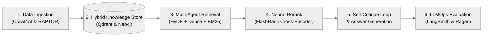
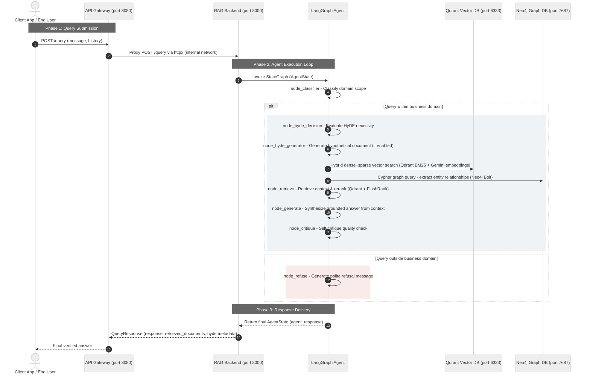
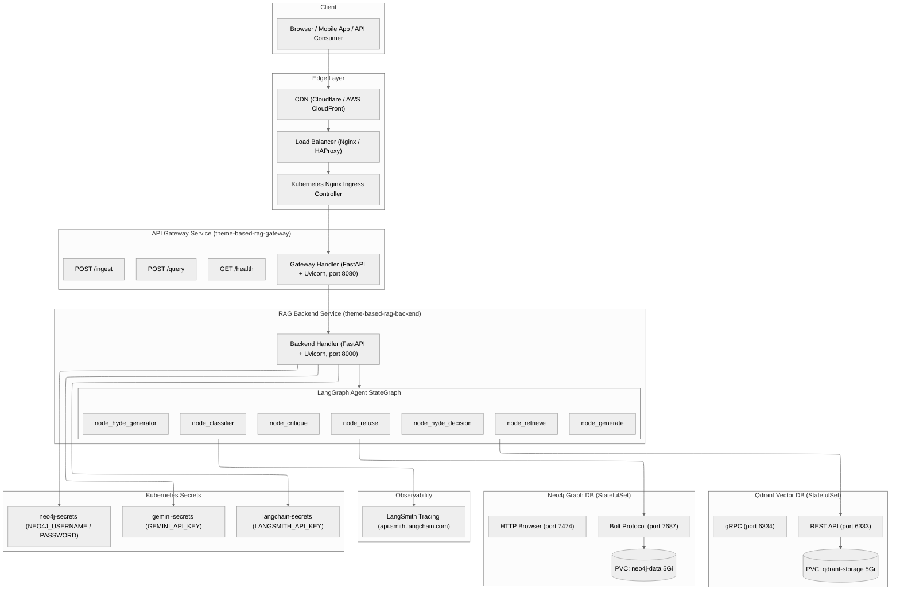
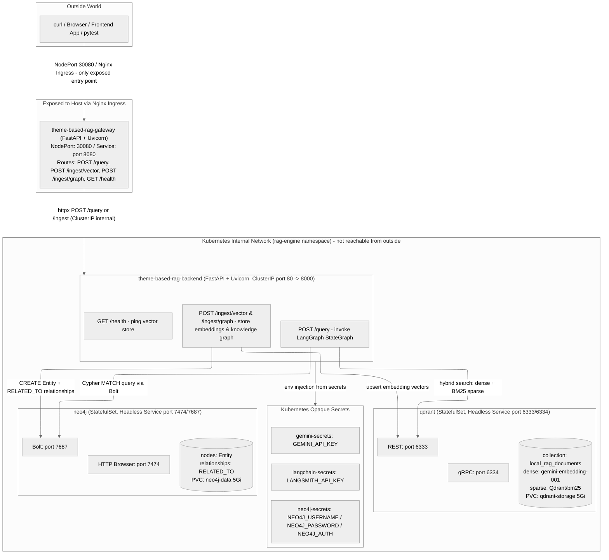

# Enterprise-RAG-Engine

> Modular, enterprise-grade Retrieval-Augmented Generation (RAG) backend engine template with multi-agent orchestration, hybrid vector search, and GraphRAG entity-relationship reasoning.


---

## End-to-End Pipeline Architecture



---

## 1. Core Purpose & Business Value

The **Enterprise-RAG-Engine** eliminates the guesswork from AI-powered customer support by restricting every generated answer to verified, company-owned knowledge — making hallucination structurally impossible.

- **Zero Hallucination, 100% Accuracy**: Every customer response is grounded in the company's own documentation and knowledge base, guaranteeing factual accuracy with no invented information.
- **Domain Boundary Enforcement**: The engine automatically rejects off-topic inquiries, keeping support conversations strictly within defined business domains (e.g., Fintech SaaS product documentation).
- **Comprehensive Knowledge Coverage**: Combines traditional document search with intelligent entity-relationship mapping, surfacing connections between products, pricing tiers, and organizational hierarchies that simple search cannot find.
- **Self-Correcting Quality Assurance**: An automated review loop verifies every draft answer against source material before delivery, catching errors before customers ever see them.
- **Plug-and-Play Backend Template**: The decoupled microservices architecture means this engine can be connected to any customer portal, mobile app, or internal tool with minimal integration effort.
- **Intelligent Query Enhancement**: Automatically improves vague or abstract questions via hypothetical document expansion, maximizing the chance of surfacing the most relevant knowledge for complex queries.

---

## 2. System Architecture & Technical Execution

The platform separates an API Gateway proxy (`theme_based_rag_gateway`) from the core RAG engine (`theme_based_rag_backend`). The backend runs a stateful multi-node LangGraph agent that performs domain classification, optional HyDE query expansion, hybrid vector + graph retrieval, neural reranking (FlashRank), and a self-critique quality loop before returning a response.

### Core Concept & Phased Execution Sequence



---

### High-Level Target Production Architecture



---

### Kubernetes Network & Service Isolation Design



---

## 3. Repository Structure

```text
Enterprise-RAG-Engine/
├── infra/
│   └── terraform/
│       ├── backend.tf                 # Backend Deployment + ClusterIP Service
│       ├── gateway.tf                 # Gateway Deployment + NodePort Service
│       ├── ingress.tf                 # Nginx Ingress routing rule
│       ├── neo4j.tf                   # Neo4j StatefulSet + Headless Service + PVC
│       ├── qdrant.tf                  # Qdrant StatefulSet + Headless Service + PVC
│       ├── secrets.tf                 # Kubernetes Opaque Secrets
│       ├── namespace.tf               # Kubernetes namespace definition
│       ├── providers.tf               # Terraform provider configuration
│       ├── variables.tf               # Input variable declarations
│       ├── outputs.tf                 # Terraform output definitions
│       └── terraform.tfvars.example   # Example variable values (safe to commit)
├── scripts/
│   ├── build-image.sh                 # Docker image build and push
│   ├── deploy_aws.sh                  # AWS EKS deployment helper
│   ├── deploy_terraform.sh            # Terraform init + apply automation
│   ├── setup_env.sh                   # Local .env setup helper
│   └── test_k8s_ingress.sh            # Smoke test against K8s ingress endpoint
├── src/
│   ├── theme_based_rag_backend/
│   │   ├── agent_flow/                # LangGraph StateGraph nodes and edges
│   │   ├── Dockerfile                 # Multi-stage production container image
│   │   ├── config.py                  # Environment variable configuration
│   │   ├── graph_db.py                # Neo4j driver, entity extraction, Cypher queries
│   │   ├── vector_db.py               # Qdrant hybrid search, embedding pipeline
│   │   ├── tools.py                   # LangGraph tool: retrieve_VDB
│   │   ├── models.py                  # Pydantic request/response schemas
│   │   └── main.py                    # FastAPI app: /query, /ingest, /health
│   └── theme_based_rag_gateway/
│       ├── Dockerfile                 # Gateway container image
│       ├── main.py                    # FastAPI app: proxy routing via httpx
│       └── models.py                  # Pydantic request/response schemas
├── tests/
│   ├── conftest.py                    # Pytest fixtures and shared setup
│   ├── test_unit_gateway.py           # Unit tests: gateway proxy routing
│   ├── test_unit_hyde.py              # Unit tests: HyDE generation node
│   ├── test_unit_hyde_decision.py     # Unit tests: HyDE decision node
│   ├── test_integration_agent_flow.py # Integration: full agent graph run
│   ├── test_integration_graph_db.py   # Integration: Neo4j entity operations
│   ├── test_e2e_api.py                # E2E: full query against running services
│   ├── test_e2e_k8s.py                # E2E: smoke tests against K8s ingress
│   └── e2e_aws.py                     # E2E: AWS EKS deployment validation
├── pyproject.toml                     # Project metadata, dependencies, ruff + pytest config
├── langgraph.json                     # LangGraph API server configuration
└── README.md
```
