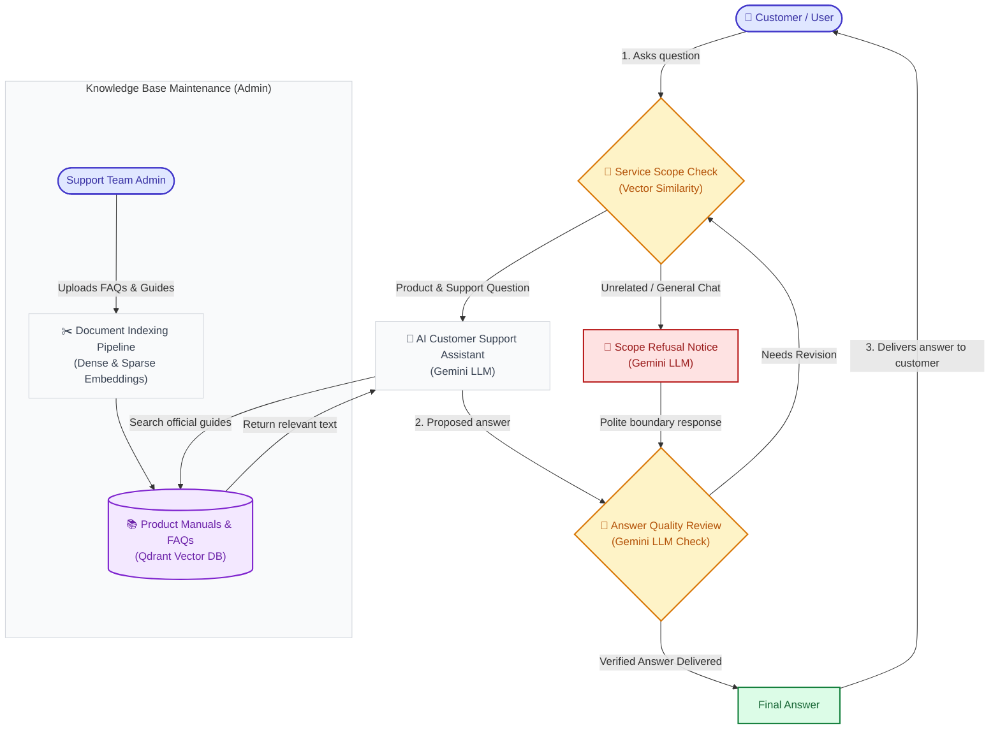
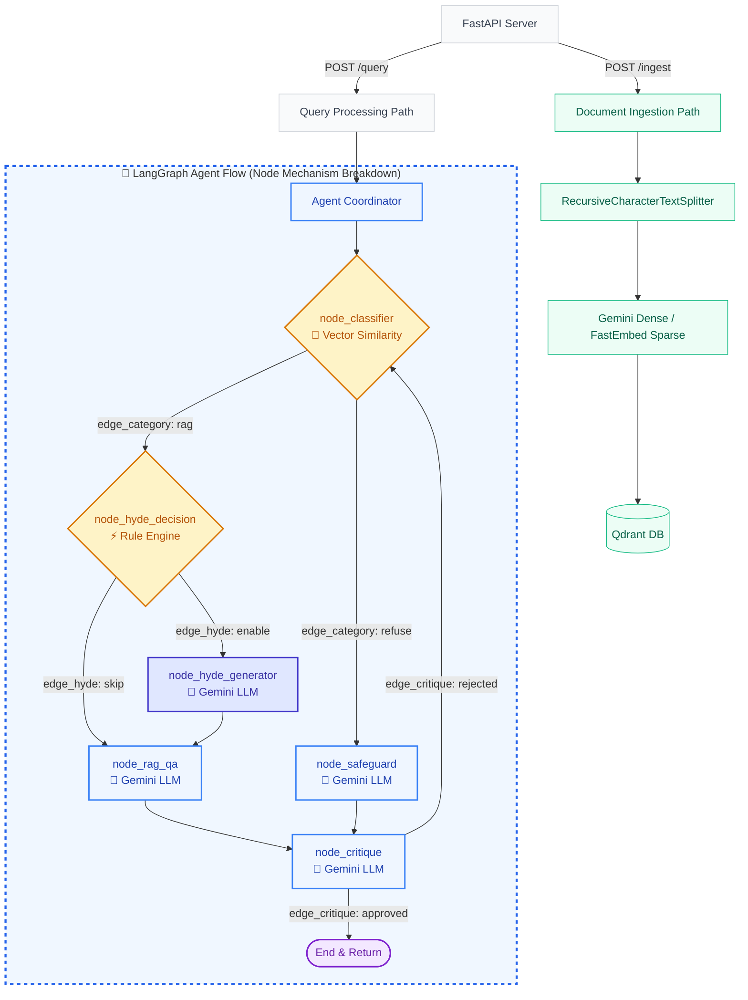
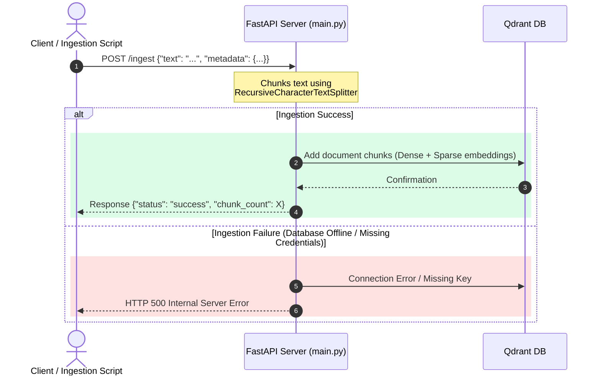
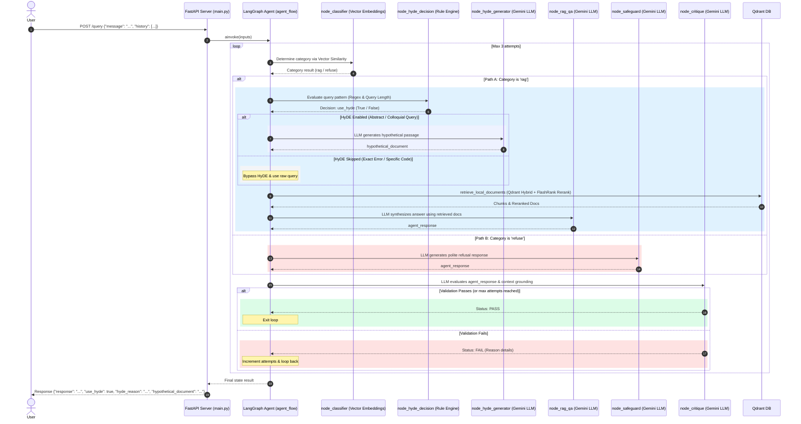

# Theme-Based RAG Workflow

A modular, stateless Retrieval-Augmented Generation (RAG) customer service chatbot utilizing the Google Gemini API, Qdrant for vector storage, and an adaptive LangGraph multi-agent workflow featuring HyDE (Hypothetical Document Embeddings) query transformation.

---

## Business & Product Flow (Overview)

Below is a high-level view of how customer requests flow through the system, detailing the execution mechanism (LLM vs Vector Search vs Rules) of each step:



---

## Features & API Endpoints

The backend exposes HTTP endpoints via FastAPI:

- **`POST /ingest`**: Accepts raw text documents, splits them into manageable chunks (using `RecursiveCharacterTextSplitter`), generates dense Gemini embeddings and sparse BM25 embeddings, and stores them in Qdrant.
- **`POST /query`**: Accepts user queries and conversation history. Routes queries dynamically through the LangGraph workflow:
  - **`node_classifier`** *(Vector Similarity)*: Determines theme boundary adherence (`rag` vs `refuse`).
  - **`node_hyde_decision`** *(Rule Engine)*: Evaluates query patterns to decide whether to enable HyDE (`use_hyde: true/false`).
  - **`node_hyde_generator`** *(Gemini LLM)*: Generates hypothetical passage excerpts for abstract or non-technical queries.
  - **`node_rag_qa`** *(Gemini LLM)*: Performs Qdrant hybrid retrieval + FlashRank cross-encoder reranking and synthesizes answers.
  - **`node_critique`** *(Gemini LLM)*: Performs strict quality and grounding checks before returning answers.
- **`GET /health`**: Performs liveness checks, confirming vector store readiness.

---

## Configuration

The application is configured using environment variables (stored locally in a `.env` file).

| Environment Variable | Description | Default Value |
| :--- | :--- | :--- |
| `GEMINI_API_KEY` | Google Gemini API credentials | *(Required)* |
| `GEMINI_MODEL` | Gemini LLM model for routing and synthesis | `gemini-3.1-flash-lite` |
| `GEMINI_EMBED_MODEL` | Google Generative AI embeddings model | `gemini-embedding-001` |
| `GEMINI_TEMPERATURE` | Generation temperature (0.0 for deterministic RAG answers) | `0.0` |
| `PORT` | FastAPI server port for Chatbot Backend | `8000` |
| `HOST` | FastAPI server bind address | `0.0.0.0` |
| `QDRANT_URL` | URL to access Qdrant instance (e.g. `http://localhost:6333` or `:memory:`) | *(Required)* |
| `QDRANT_API_KEY` | Optional API Key if using Qdrant Cloud | `None` |
| `CHATBOT_THEME` | The primary theme boundary for retrieval routing & safeguards | `Fintech SaaS platform` |

---

## Technical Architecture & Logic Flow

Below is the technical flowchart detailing node execution mechanisms (**LLM** vs **Vector Similarity** vs **Rule Engine**):



### 1. Ingestion Path

The ingestion pipeline splits input text and uploads semantic chunks (with both dense Gemini and sparse BM25 embeddings) to Qdrant.



### 2. Query Path & Adaptive HyDE Sequence Flow

When a query is received, the request is dispatched to a stateful LangGraph agent workflow containing dynamic classification, HyDE decision/generation, RAG QA, and grounding evaluation:



---

## Agent Flow Modular Architecture & Node Mechanisms

All nodes and edges inside `src/theme_based_rag_backend/agent_flow` follow explicit prefix naming conventions, with their underlying execution mechanism (**LLM** vs **Vector Search** vs **Rules**) explicitly defined:

| Node Module | File Link | Execution Mechanism | Purpose & Model |
| :--- | :--- | :--- | :--- |
| `node_classifier` | [node_classifier.py](file:///c:/Users/boyce/OneDrive/Desktop/rag-chatbot/src/theme_based_rag_backend/agent_flow/nodes/node_classifier.py) | **📐 Vector Similarity** | Embeddings Cosine Similarity against `CHATBOT_THEME` (`gemini-embedding-001`) |
| `node_hyde_decision` | [node_hyde_decision.py](file:///c:/Users/boyce/OneDrive/Desktop/rag-chatbot/src/theme_based_rag_backend/agent_flow/nodes/node_hyde_decision.py) | **⚡ Rule Engine** | Fast heuristic pattern matching (Regex for error codes & Query length) |
| `node_hyde_generator` | [node_hyde_generator.py](file:///c:/Users/boyce/OneDrive/Desktop/rag-chatbot/src/theme_based_rag_backend/agent_flow/nodes/node_hyde_generator.py) | **🤖 Gemini LLM** | Generates hypothetical document passage (`gemini-3.1-flash-lite`) |
| `node_rag_qa` | [node_rag_qa.py](file:///c:/Users/boyce/OneDrive/Desktop/rag-chatbot/src/theme_based_rag_backend/agent_flow/nodes/node_rag_qa.py) | **🤖 Gemini LLM** | Hybrid retrieval consumer & answer synthesis (`gemini-3.1-flash-lite`) |
| `node_safeguard` | [node_safeguard.py](file:///c:/Users/boyce/OneDrive/Desktop/rag-chatbot/src/theme_based_rag_backend/agent_flow/nodes/node_safeguard.py) | **🤖 Gemini LLM** | Polite boundary refusal response (`gemini-3.1-flash-lite`) |
| `node_critique` | [node_critique.py](file:///c:/Users/boyce/OneDrive/Desktop/rag-chatbot/src/theme_based_rag_backend/agent_flow/nodes/node_critique.py) | **🤖 Gemini LLM** | Quality, groundedness & hallucination check (`gemini-3.1-flash-lite`) |

---

## Local Development & Testing Setup

### 1. Environment Setup

```bash
python -m venv venv
source venv/bin/activate  # On Windows: .\venv\Scripts\activate
pip install -r requirements.txt
```

### 2. Configure Environment Variables

Create a `.env` file in the root directory:
```env
GEMINI_API_KEY=your_gemini_api_key_here
GEMINI_MODEL=gemini-3.1-flash-lite
QDRANT_URL=http://localhost:6333
CHATBOT_THEME=Fintech SaaS platform
```

### 3. Run Automated Unit & Integration Tests

```powershell
# Run full local backend and gateway test suite
.\venv\Scripts\python.exe -m pytest tests/ --ignore=tests/test_k8s_e2e.py -v
```

### 4. Start Services

```powershell
# Backend FastAPI server (port 8000)
.\venv\Scripts\python.exe -m uvicorn src.theme_based_rag_backend.main:app --host 0.0.0.0 --port 8000 --reload

# Gateway FastAPI server (port 8080)
.\venv\Scripts\python.exe -m uvicorn src.theme_based_rag_gateway.main:app --host 0.0.0.0 --port 8080 --reload
```

---

## Terraform Infrastructure Provisioning

You can provision and manage all Kubernetes resources (Namespace, Secrets, Qdrant StatefulSet, Backend/Gateway Deployments, Services, and Ingress) declaratively using Terraform:

```powershell
# Navigate to terraform directory
cd infra/terraform


# Initialize Terraform providers
terraform init

# Validate Terraform configuration
terraform validate

# Plan infrastructure deployment
terraform plan -out=tfplan

# Apply infrastructure to Kubernetes cluster
terraform apply tfplan
```