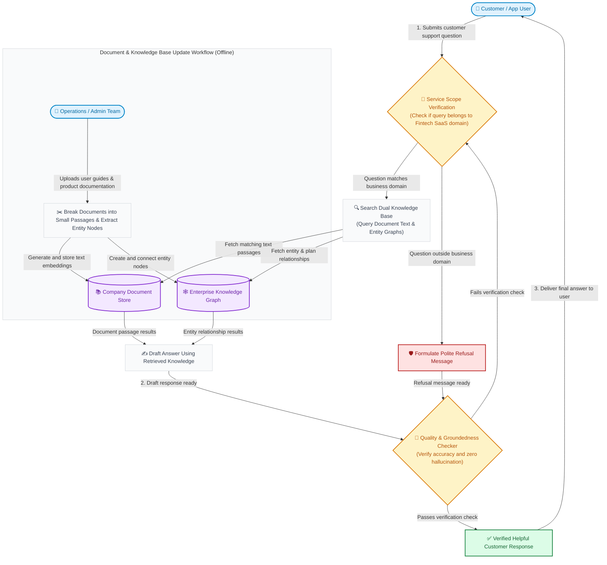
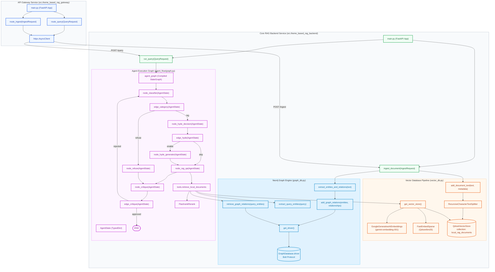
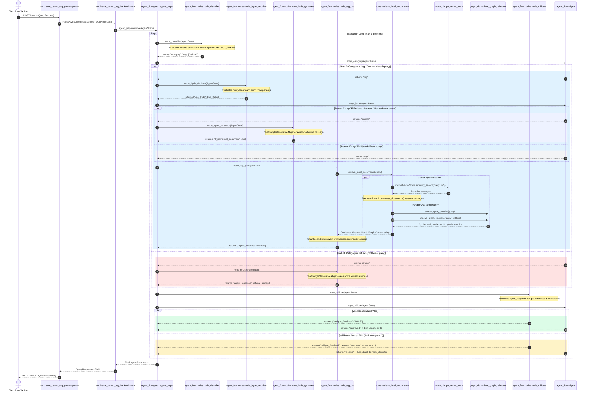

# Enterprise-RAG-Engine

A modular, enterprise-grade Retrieval-Augmented Generation (RAG) backend engine template utilizing Google Gemini API, LangGraph agent orchestration, Qdrant vector search, and Neo4j Knowledge Graph database for GraphRAG entity-relationship reasoning.

---

## Core Purpose & RAG Fundamental Concept

### What is RAG? (Context Provision for LLMs)
Large Language Models (LLMs) excel at general reasoning and language understanding, but lack internal knowledge of custom enterprise datasets and can hallucinate when asked about domain-specific facts. 

**Retrieval-Augmented Generation (RAG)** solves this by retrieving exact, verified context from trusted database stores (Vector DBs and Knowledge Graphs) and injecting it into the LLM prompt:

1. **Context Retrieval**: Fetches top matching passages (Qdrant hybrid vector/lexical search) and connected entity graphs (Neo4j GraphRAG).
2. **Context Injection**: Supplies the structured ground-truth facts directly to the LLM.
3. **Grounded Generation**: Restricts the LLM (Google Gemini) to synthesize responses solely based on the provided context, guaranteeing high precision and zero hallucination.

### RAG Backend Engine Template
This project is structured as a **reusable backend template**. It separates the API Gateway proxy from core retrieval and agent state graph nodes, making it effortless to plug into any customer portal, mobile app, or internal tool.

---

## Dual-Perspective Project Summarization

### Business Focus
The **Enterprise-RAG-Engine** is designed to provide high-value, enterprise customer support while guaranteeing 100% answer accuracy and zero AI hallucinations. 

- **Domain Safeguard Enforcement**: Automatically screens every customer inquiry to ensure it remains strictly within defined business domain boundaries (e.g., Fintech SaaS platform documentation), immediately preventing off-topic usage.
- **GraphRAG & Hybrid Vector Knowledge Retrieval**: Combines semantic text retrieval with Neo4j graph relationship mapping (GraphRAG) to provide comprehensive context on interconnected entities such as pricing tiers, product feature dependencies, and organization hierarchies.
- **Adaptive HyDE Answer Enhancement**: Dynamically generates hypothetical answer passages for abstract user questions, significantly boosting document retrieval accuracy.
- **Self-Correcting Quality Assurance**: Employs an automated self-critique review process that verifies answer candidates against source context before delivering the final response to customers.

### Tech Focus
The application follows a microservices architecture separating an API Gateway proxy (`src.theme_based_rag_gateway`) from the core RAG backend engine (`src.theme_based_rag_backend`). The stateful multi-agent execution loop is built on LangGraph, combining Qdrant hybrid vector search (dense Gemini embeddings + BM25 sparse lexical tokens) with Neo4j Cypher graph queries and FlashRank neural reranking.

#### Technology Stack & Shields.io Badges

*  **Python 3.10+**: Primary programming language and execution environment.
*  **FastAPI**: Asynchronous web framework used for API Gateway and backend services.
*  **LangGraph**: Orchestration framework for multi-node agent state graphs, conditional routing, and self-critique loops.
*  **LangChain**: Text chunking utilities (`RecursiveCharacterTextSplitter`), document model abstractions, and LLM integrations.
*  **Google Gemini API**: Powers LLM decision-making (`gemini-3.1-flash-lite`) and dense vector embeddings (`gemini-embedding-001`).
*  **Qdrant Vector DB**: Vector database supporting hybrid dense-sparse passage retrieval and metadata filtering.
*  **Neo4j Graph DB**: Graph database storing extracted entities and 1-hop relationships for GraphRAG context.
*  **FastEmbed BM25**: Lightweight sparse lexical embedding model (`Qdrant/bm25`).
*  **FlashRank**: Cross-encoder neural reranker used to rank merged vector and graph passages.
*  **LangSmith**: Observability and execution tracing platform for agent steps and LLM prompt calls.
*  **HTTPX**: Asynchronous HTTP client powering gateway proxy routing.
*  **Uvicorn**: Production ASGI server implementation for FastAPI endpoints.
*  **Terraform**: Infrastructure as Code (IaC) tool for Kubernetes namespace, secrets, deployments, and services.
*  **Docker**: Containerization infrastructure for microservices, Qdrant, and Neo4j.

---

## Mandatory System Diagrams

### 1. Business Flow Mermaid Diagram

Below is a simplified operational workflow designed for business managers and product stakeholders, illustrating how customer support questions and knowledge base updates flow through the system:

---

### 2. Technical Architecture Mermaid Diagram

Below is the technical architecture diagram showing component structures, class implementations, module dependencies, state graph nodes, and database connection drivers:

---

### 3. Technical & Business Logic Sequence Diagram

Below is the technical sequence diagram illustrating exact execution flows, class method calls, data payloads, and conditional routing logic highlighted with colorized alternative blocks:

---

## System Configuration & Environment Variables

The application is configured using environment variables (stored in `.env`):

| Environment Variable | Description | Default Value |
| :--- | :--- | :--- |
| `GEMINI_API_KEY` | Google Gemini API credentials | *(Required)* |
| `GEMINI_MODEL` | Gemini LLM model for routing, HyDE, QA, and critique | `gemini-3.1-flash-lite` |
| `GEMINI_EMBED_MODEL` | Google Generative AI embeddings model | `gemini-embedding-001` |
| `GEMINI_TEMPERATURE` | Generation temperature (0.0 for deterministic RAG) | `0.0` |
| `PORT` | FastAPI server port for Backend | `8000` |
| `HOST` | FastAPI server bind address | `0.0.0.0` |
| `QDRANT_URL` | URL to access Qdrant instance | `http://localhost:6333` |
| `QDRANT_API_KEY` | Optional API Key if using Qdrant Cloud | `None` |
| `NEO4J_URI` | Neo4j Bolt connection URI for GraphRAG | `bolt://localhost:7687` |
| `NEO4J_USERNAME` | Neo4j authentication username | `neo4j` |
| `NEO4J_PASSWORD` | Neo4j authentication password | `password123` |
| `CHATBOT_THEME` | The primary theme boundary for retrieval routing | `Fintech SaaS platform` |

---