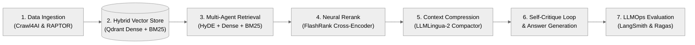
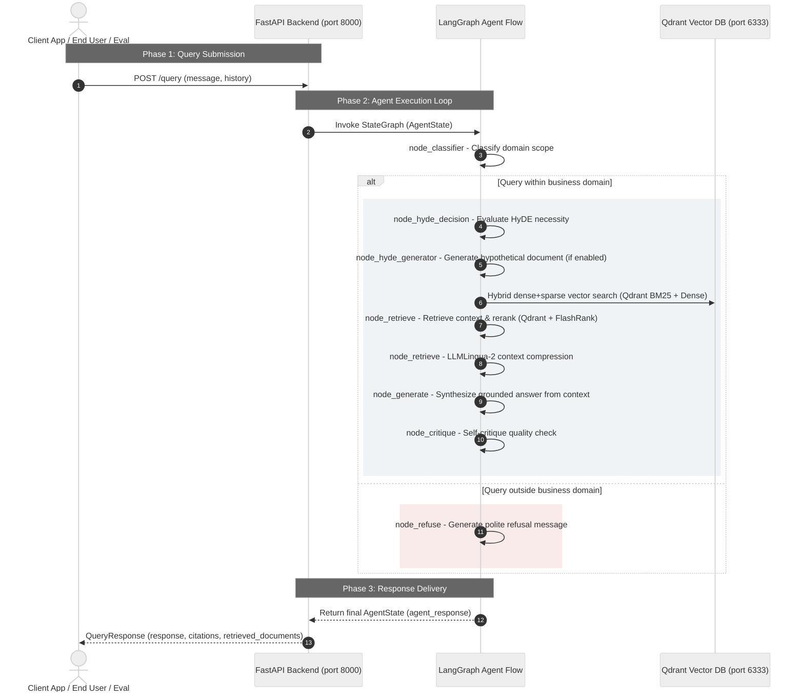
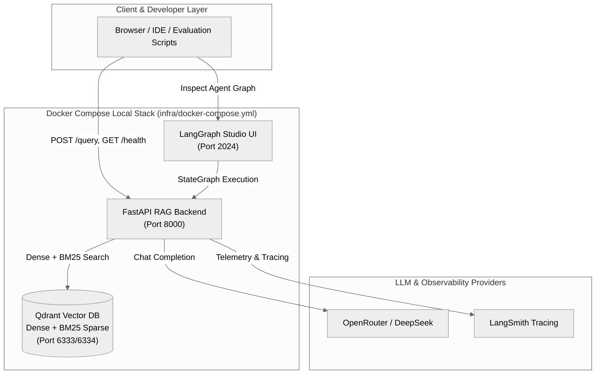

# Enterprise-RAG-Engine

> Modular, enterprise-grade Retrieval-Augmented Generation (RAG) backend engine template with multi-agent orchestration, hybrid vector search, and Small-to-Big retrieval.


---

## End-to-End Pipeline Architecture



---

## 1. Core Purpose & Business Value

The **Enterprise-RAG-Engine** eliminates the guesswork from AI-powered enterprise knowledge acquisition by restricting every generated answer to verified, company-owned knowledge — making hallucination structurally impossible.

- **Zero Hallucination, 100% Accuracy**: Every response is grounded in internal documentation and historical issue stores, guaranteeing factual accuracy with no invented information.
- **Domain Boundary Enforcement**: The engine automatically classifies and routes inquiries, keeping workflows strictly within defined business domains.
- **Comprehensive Hybrid Search**: Combines dense semantic vector search with BM25 sparse retrieval in Qdrant, surfacing exact variable names, error codes, and log patterns.
- **Self-Correcting Quality Assurance**: An automated review loop verifies every draft answer against source material before delivery, catching errors before users see them.
- **Prompt Token & Latency Optimization**: Integrates LLMLingua-2 context compression to compact retrieved passages, reducing LLM token consumption and latency while preserving vital semantic facts.
- **Streamlined Backend Architecture**: Direct client interaction via FastAPI on port 8000 and LangGraph Studio on port 2024 for real-time visualization.

---

## 2. System Architecture & Technical Execution

The engine runs a stateful multi-node LangGraph agent within `theme_based_rag_backend`. The backend performs domain classification, optional HyDE query expansion, hybrid vector retrieval, neural reranking (FlashRank), context compression (LLMLingua-2), and a self-critique quality loop before returning a response.

### Core Execution Sequence



---

### Streamlined Multi-Container Architecture



---

## 3. Repository Structure

```text
Enterprise-RAG-Engine/
├── infra/
│   ├── build-image.sh                 # Docker backend image build script
│   └── docker-compose.yml             # Streamlined 3-service stack (Qdrant, Studio, Backend)
├── preprocessing-pipeline/
│   ├── 1.export_jira_tickets.py       # JIRA REST API ticket exporter
│   ├── 2.model_jira_defects.py        # AI defect modeling & Horizontal expansion checklist
│   ├── 3.ingest_to_qdrant.py          # Hybrid dense + BM25 vector ingestion
│   └── llm_client.py                  # Embedding & LLM client wrapper
├── progress-doc/                      # Weekly engineering milestone reports
├── src/
│   └── theme_based_rag_backend/
│       ├── agent_flow/                # LangGraph StateGraph nodes and routing edges
│       ├── Dockerfile                 # Multi-stage production container image
│       ├── config.py                  # Environment variable configuration
│       ├── vector_db.py               # Qdrant hybrid search & collection management
│       ├── tools.py                   # LangGraph retrieval tools
│       ├── models.py                  # Pydantic request/response schemas
│       └── main.py                    # FastAPI server: /query, /health
├── eval/                              # Ragas automated evaluation datasets & scripts
├── JIRA_BUGGRAPH_AI.md                # JIRA-BugGraph AI system specification & roadmap
├── pyproject.toml                     # Python dependencies & Ruff/Pytest configuration
├── langgraph.json                     # LangGraph CLI / Studio configuration
└── README.md
```

---

## 4. Quick Start Guide

### 1. Start Multi-Container Infrastructure
```powershell
docker compose -f infra/docker-compose.yml up --build -d
```

### 2. Verify System Health
```powershell
curl http://localhost:8000/health
```

### 3. Open Developer Tools
* **LangGraph Studio**: [http://localhost:2024](http://localhost:2024)
* **Qdrant Dashboard**: [http://localhost:6333/dashboard](http://localhost:6333/dashboard)
