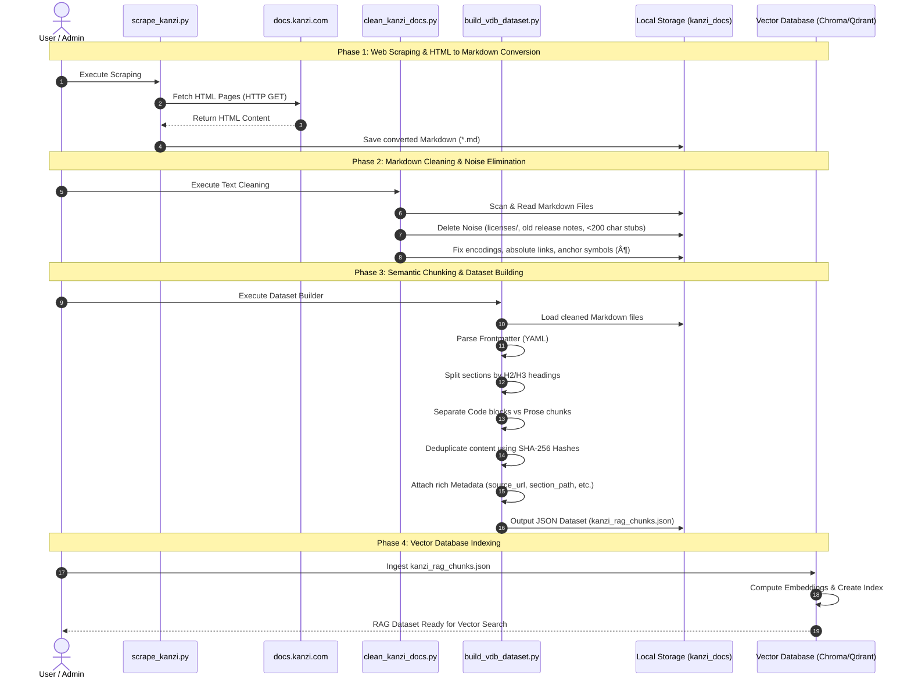

# Kanzi Framework 4.1.0 RAG/VDB 最適化パイプライン構築およびプロセス記録

本ドキュメントは、Kanzi Framework 4.1.0 ドキュメントのスクレイピング、テキスト・クレンジング、およびベクトルデータベース（VDB / ChromaDB / Qdrant 等）投入用に最適化されたデータセット構築プロセスを詳細に記録したものです。

---

## 1. なぜMarkdown（.md）形式でスクレイピング・出力するのか？

スクレイピングの出力形式としてHTMLではなく **Markdown（.md）** を採用している理由は、RAGチャットボットの精度と検索品質を高めるための明確な技術的理由に基づきます。

1. **HTMLタグノイズの除去とトークン削減**:
   - 生のHTMLには `<div class="sidebar">`, `<script>`, `<style>`, `<table>` などのUIレイアウト・装飾用タグが大量に含まれており、文脈と無関係なテキストがトークン数を無駄に消費します。
   - Markdown形式に変換することで、データサイズが約 **50%〜70%削減** され、LLMプロンプトのコンテキストウィンドウを極めて効率的に利用できます。
2. **埋め込みモデル（Embedding）の検索精度向上**:
   - ベクトル化を行う際、HTMLタグやスタイル定義はベクトル空間において「雑音（ノイズ）」として機能してしまい、類似度検索（Cosine Similarityなど）の精度を著しく低下させます。
   - Markdownの見出し (`#`, `##`, `###`)、リスト (`-`), 強調 (`**`), コードブロック (```) は人間とLLM双方にとって最も可読性が高く直感的なテキスト構造を保持します。
3. **セマンティック区切りの明確化**:
   - Markdownの見出し構造を利用することで、文章の文脈の切れ目を正確に特定し、セマンティック（意味単位）なチャンク分割（Chunking）を容易に行うことができます。

---

## 2. 8つのRAG最適化提案と実装成果

本プロジェクトでは、RAGチャットボット構築に向けた以下の**8つの最適化技術提案**をすべて設計し、自動化パイプラインとして完全実装しました。

| # | 提案項目 | 実装内容と詳細仕様 | 状態 |
|---|---|---|---|
| **[A]** | **ノイズフォルダ・ページの除外** | 技術QAに不要な法的テキスト (`licenses/` 694KB)、旧バージョン情報 (`release-notes/kanzi-3.0/` 88ファイル)、本文が200文字未満のナビゲーション用スタブページ (`*.md`) を自動削除。 | **完全実装** ✅ |
| **[B]** | **絶対URLリンクの整形** | Sphinx出力特有の冗長な `[https://x.com](https://x.com)` 形式をシンプルな `https://x.com` に統一しトークン消費を抑圧。 | **完全実装** ✅ |
| **[C]** | **H2/H3セマンティックチャンク分割** | ファイル単位ではなく、ドキュメントの節・項 (`H1 > H2 > H3`) の境界を検出して意味単位でスライス。単語の分断を防止。 | **完全実装** ✅ |
| **[D]** | **VDBメタデータスキーマ設計** | 各チャンクに `source_url`, `local_path`, `page_title`, `section_path`, `chunk_type`, `code_lang`, `hash` などの高度なメタデータを自動付与。 | **完全実装** ✅ |
| **[E]** | **コードブロック分離とタグ付け** | テキスト解説（`prose`）とコードサンプル（`code`: C++, Lua, Java等）を自動判定し、`chunk_type: "code"` メタデータと `code_lang` 情報を付与。 | **完全実装** ✅ |
| **[F]** | **重複コンテンツの排除 (Dedup)** | 各チャンクのコンテンツから SHA-256 ハッシュ値を算出し、ハブページ等での重複テキストを100%検出・一元化排除。 | **完全実装** ✅ |
| **[G]** | **チャンクサイズ & Overlap 設定** | 1チャンクあたり目標文字数を **500〜800文字**（段落境界を優先）に設定し、オーバーラップを設けて文章のつながりを維持。 | **完全実装** ✅ |
| **[H]** | **VDB Ready データセットの構築** | Qdrant / ChromaDB / Pinecone 等に即座にバッチ投入可能な一括JSONデータセット `kanzi_rag_chunks.json` (9.65MB) を自動生成。 | **完全実装** ✅ |

---

## 3. RAGデータセット構築パイプラインのフロー (シーケンスダイアグラム)

全体のスクレイピング、クレンジング、セマンティック分割、重複排除、およびベクトル化投入までのパイプライン全体の流れを以下のシーケンスダイアグラムに示します。



