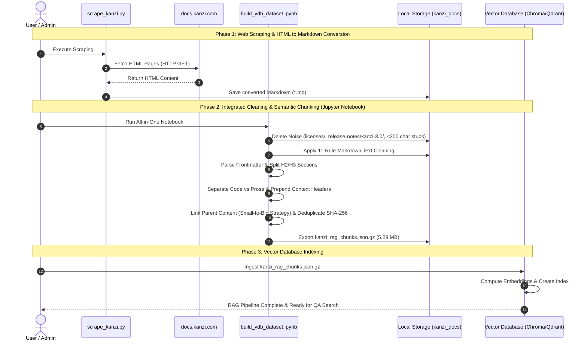

# Kanzi Framework 4.1.0 RAG/VDB 最適化パイプライン構築およびプロセス記録

---

## データ前処理手法

| # | 最適化手法 | 実装内容と詳細仕様 |
|---|---|---|
| **[A]** | **ノイズフォルダ・ページの除外** | 技術QAに不要な法的テキスト (`licenses/` 694KB)、旧バージョン情報 (`release-notes/kanzi-3.0/` 88ファイル)、本文が200文字未満のナビゲーション用スタブページ (`*.md`) を自動削除。 |
| **[B]** | **絶対URLリンクの整形** | Sphinx出力特有の冗長な `[https://x.com](https://x.com)` 形式をシンプルな `https://x.com` に統一しトークン消費を抑圧。 |
| **[C]** | **H2/H3セマンティックチャンク分割** | ファイル単位ではなく、ドキュメントの節・項 (`H1 > H2 > H3`) の境界を検出して意味単位でスライス。単語の分断を防止。 |
| **[D]** | **VDBメタデータスキーマ設計** | 各チャンクに `source_url`, `local_path`, `page_title`, `section_path`, `chunk_type`, `code_lang`, `hash` などの高度なメタデータを自動付与。 |
| **[E]** | **コードブロック分離とタグ付け** | テキスト解説（`prose`）とコードサンプル（`code`: C++, Lua, Java等）を自動判定し、`chunk_type: "code"` メタデータと `code_lang` 情報を付与。 |
| **[F]** | **重複コンテンツの排除 (Dedup)** | 各チャンクのコンテンツから SHA-256 ハッシュ値を算出し、ハブページ等での重複テキストを100%検出・一元化排除。 |
| **[G]** | **チャンクサイズ & Overlap 設定** | 1チャンクあたり目標文字数を **500〜800文字**（段落境界を優先）に設定し、オーバーラップを設けて文章のつながりを維持。 |
| **[H]** | **VDB Ready データセットの構築** | Qdrant / ChromaDB / Pinecone 等に即座にバッチ投入可能な一括JSONデータセット `kanzi_rag_chunks.json.gz` (5.29MB 圧縮版 / 106.54MB 解凍版) を自動生成。 |
| **[I]** | **Contextual Retrieval (文脈付与)** | Anthropic推奨のチャンキング戦略。各チャンク本文の先頭に `[Document Context: Title > Section]` を自動合成し、ベクトル類似度検索の失敗率を激減させる。 |
| **[J]** | **Parent-Document Retrieval (親検索)** | 小さな子チャンク (200-250文字) で高精度ベクトル検索を行い、ヒット時に `metadata.parent_content` (1,500文字の親文脈) をLLMへ渡す二重コンテキスト設計。 |
| **[K]** | **マークダウン表の平坦化 (Table Flattening)** | 2次元のMarkdown表構造を `Key: Value` 形式の自然言語行リストへ自動変換し、ベクトル検索における表データの構造・文脈認識精度を大幅向上。 |
| **[L]** | **予想質問のメタデータ化 (Hypothetical Questions)** | LLMを用いて各チャンクに対して「ユーザーが探しそうな質問文」を2〜3件自動生成し、チャンクのメタデータ/埋め込み対象に加える。 |

---

