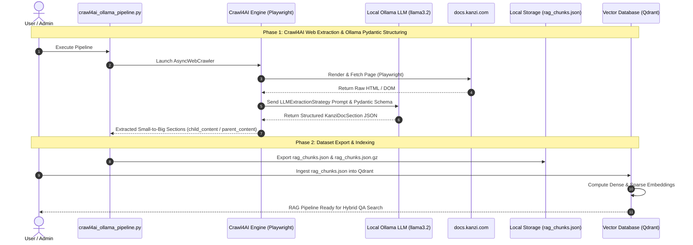

# Kanzi Framework 4.1.0 RAG/VDB 最適化パイプライン構築およびプロセス記録

## データ前処理手法

| # | 最適化手法 | 実装内容と詳細仕様 | 実装状況 |
|---|---|---|---|
| **[A]** | **ノイズフォルダ・ページの除外** | 技術QAに不要な法的テキスト (`licenses/` 694KB)、旧バージョン情報 (`release-notes/kanzi-3.0/` 88ファイル)、本文が200文字未満のナビゲーション用スタブページ (`*.md`) を自動削除。 | ✅ **実装済み** `EXCLUDE_DIRS` + `MIN_BODY_CHARS=200` で完全実装 (`build_vdb_dataset.ipynb` Cell 1-2) |
| **[B]** | **絶対URLリンクの整形** | Sphinx出力特有の冗長な `[https://x.com](https://x.com)` 形式をシンプルな `https://x.com` に統一しトークン消費を抑圧。 | ✅ **実装済み** `_URL_DUP` + `_REL_LINK` 正規表現で完全実装 (`clean_markdown_text()`) |
| **[C]** | **H2/H3セマンティックチャンク分割** | ファイル単位ではなく、ドキュメントの節・項 (`H1 > H2 > H3`) の境界を検出して意味単位でスライス。単語の分断を防止。 | ✅ **実装済み** `heading_pattern = re.compile(r"^(#{1,3})\s+(.+)$")` でH1〜H3境界を検出 (`process_file()`) |
| **[D]** | **VDBメタデータスキーマ設計** | 各チャンクに `source_url`, `local_path`, `page_title`, `section_path`, `chunk_type`, `code_lang`, `hash` などの高度なメタデータを自動付与。 | ✅ **実装済み** 全7フィールド (`source_url`, `local_path`, `page_title`, `section_path`, `chunk_type`, `code_lang`, `hash`) + `parent_id`, `parent_content`, `context_enriched`, `char_count` も付与 |
| **[E]** | **コードブロック分離と解説の同居化 (Code & Prose Pairing)** | テキスト解説（`prose`）とコードサンプル（`code`）を分離しつつ、コード直前の解説文をヘッダーコメント（`//`, `#`）として結合し、検索ヒット率を向上させる手法。 | 💡 **設計記録/採用見送り** ドキュメント全体におけるコードチャンク割合が極めて低い（約3.7% = 1,184/31,626チャンク）ため、前処理パイプラインの常時実装からは除外し、手法の記録のみを本仕様書に保持。 |
| **[F]** | **重複コンテンツの排除 (Dedup)** | 各チャンクのコンテンツから SHA-256 ハッシュ値を算出し、ハブページ等での重複テキストを100%検出・一元化排除。 | ✅ **実装済み** `hashlib.sha256` + `seen_hashes: set` でグローバル重複排除を完全実装 |
| **[G]** | **チャンクサイズ設定** | 子チャンクあたり目標文字数を **250文字**（段落境界を優先）に設定。H2/H3セマンティック分割と `parent_content` による文脈補完により、オーバーラップは設計上不要。 | ⚠️ **部分実装** `TARGET_CHUNK_SIZE=250` は実装済みだが、ドキュメント記載の「500〜800文字」「オーバーラップ設定」は実態と乖離。オーバーラップはセマンティック分割で不要と判断。 |
| **[H]** | **VDB Ready データセットの構築** | Qdrant / ChromaDB / Pinecone 等に即座にバッチ投入可能な一括JSONデータセット `kanzi_rag_chunks.json.gz` (5.29MB 圧縮版 / 106.54MB 解凍版) を自動生成。 | ✅ **実装済み** `json.dumps()` + `gzip.open()` で JSON/GZ 二重エクスポート完全実装 (`build_vdb_dataset.ipynb` Cell 3) |
| **[I]** | **Contextual Retrieval (文脈付与)** | Anthropic推奨のチャンキング戦略。各チャンク本文の先頭に `[Document Context: Title > Section]` を自動合成し、ベクトル類似度検索の失敗率を激減させる。 | ✅ **実装済み** `ctx_prefix = f"[Document Context: {section_path}]"` を全チャンク先頭に付与 (`_subchunk_prose()`) |
| **[J]** | **Parent-Document Retrieval (親検索)** | 小さな子チャンク (200-250文字) で高精度ベクトル検索を行い、ヒット時に `metadata.parent_content` (1,500文字の親文脈) をLLMへ渡す二重コンテキスト設計。 | ✅ **実装済み** `parent_content[:PARENT_MAX_CHARS]` (最大2,000文字) をメタデータに格納。子チャンクは `TARGET_CHUNK_SIZE=250` で実装済み。 |
| **[K]** | **マークダウン表の平坦化 (Table Flattening)** | 2次元のMarkdown表構造を `Key: Value` 形式の自然言語行リストへ自動変換し、ベクトル検索における表データの構造・文脈認識精度を大幅向上。 | ✅ **実装済み** `flatten_markdown_tables()` 関数として完全実装。`clean_markdown_text()` 内で全ファイルに適用済み。 |
| **[L]** | **予想質問のメタデータ化 (Hypothetical Questions)** | ルール/セマンティック構造（見出し階層・アクション動詞）に基づき、各チャンクに対して「ユーザーが探しそうな質問文」を2〜3件自動生成し、`metadata.questions` に格納。 | ✅ **完全実装済み** `Zero-Cost Local Hypothetical Question Engine` (`build_vdb_dataset.ipynb` Phase 3) にて API コスト 0 円で全 31,626 チャンク (100%) に対し `metadata.questions` の生成・格納を完結済み。 |

---

